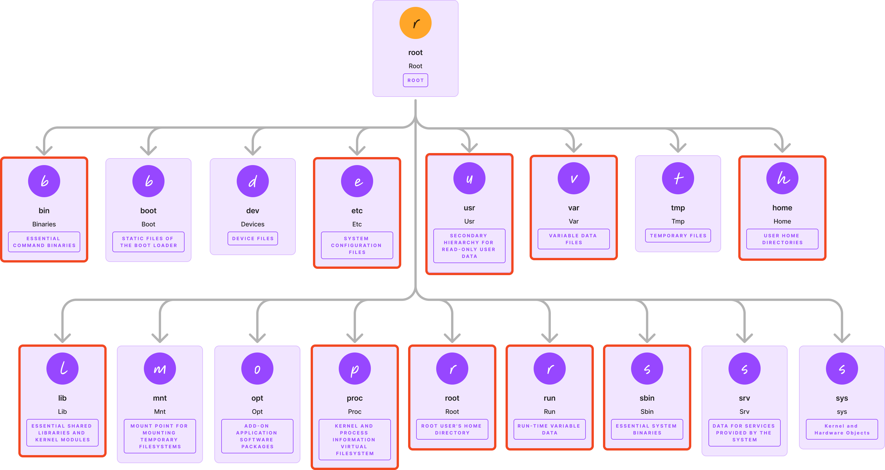

Day16 - 17

# Linux File System

## FHS

[Linux File System Explained!](https://www.youtube.com/watch?v=bbmWOjuFmgA)(이 유튜브 영상을 참고)

초기 리눅스 버전에서는, 다양한 배포판들에서 파일 시스템의 구조가 다 달라서 굉장히 혼란스러웠다고 한다. 이렇게 혼란스러울때마다 늘 등장하는 것은 역시 인터페이스인가보다. Linux 커뮤니티는 FHS(Filesystem Hierarchy Standard, 표준 파일 시스템 계층) 을 만들어서 획일화된 계층 구조를 제공했다.

물론 배포판들마다 조금씩은 다른 경우가 있다고 하지만, 아마 큰 틀에서 벗어나지 않는 정도일 것이다.

그렇다면 FHS 에서 핵심 디렉토리들에 대해서 한 번 살펴보자.

## 핵심 디렉토리들



### 실행 가능한 바이너리 (/bin, /sbin, /usr)

첫 번째로 '실행 가능한 바이너리 경로들' 인, `/bin`. `/sbin`, `/usr/bin`, `/usr/local/bin` 이다.

> /bin 에는 부팅 시, /usr 이 마운트(연결) 되기 전에 액세스해야 하는 핵심 OS 프로그램이 포함되어 있다.

즉 /usr 에 해당하는 부분이 연결되기 전에 /bin 에 있는 핵심 프로그램들이 먼저 준비가 되어있어야 한다는 것이다. `mount`, `ls`, `cd` 등이 `/bin` 에 위치하고 있다.

`/usr/bin` 은 운영체제가 제공하는 바이너리의 경로가 아니라, 사용자의 프로그램들을 위한 바이너리가 담겨져 있다. 그렇기 때문에 `usr` 를 'user' 로 착각할 수 있는데, `usr => Unix System Resources` 라고 한다.

> `/usr/local/bin` 에는 일반적으로 소스에서 빌드한 후, 관리자가 설치한 실행 파일이 보관된다.

그렇다면 /usr/bin 과 /usr/local/bin 의 차이는 뭘까?  
[bin](https://unix.stackexchange.com/questions/8656/usr-bin-vs-usr-local-bin-on-linux) 오래된 글이긴 하지만, 스택오버플로우의 글에 따르면

`/usr/bin` 은 기본 패키지 매니저에서 제공되는 소프트웨어를,  
`/usr/local/bin` 은 기본 패키지 매니저 `외부`에서 제공되는 소프트웨어를 저장하는 경로라고 한다.

예를 들어, 인텔 맥북의 경우에는 homebrew 를 통해 설치한 패키지들이 /usr/local/bin 에 저장되었다고 한다. (M1 이상부터는 /opt/homebrew/bin 에 저장된다고 한다.)  
영상에서는 firefox, VLC(동영상 플레이어) 등으로 예시를 들었다.

`/sbin` 은 root 권한이 필요한 sysadmin 유틸리티(iptables, sshd, ...)가 포함되어 있다.

이렇게 시스템 바이너리들을 위한 /bin 과 /usr 를 따로 분리함으로써, 시스템 바이너리들을 덮어쓰지 않고 별도로 유지할 수 있다. 추후 접근 시에는 이런 실행파일들의 경로에 대한 우선순위에 맞게 탐색하게 된다.

### lib

> `/lib` 에는 /bin, /sbin 바이너리에 필요한, 필수 라이브러리 파일들이 포함되어 있다.

/usr/lib 에는 초기 시스템 초기화에 중요하지 않은 /usr 바이너리용 라이브러리가 들어있다. 예시로 들었던 firefox 나, VLC 를 위한 라이브러리들이 굳이 시스템 초기화에 필요하지 않기 때문에 분리해놓은 것이다.

### etc

> etc 에는 text-based config file 들이 존재하는데, 네트워킹부터 인증 서비스까지 모든 것을 제어한다.

대표적인 예시로 우리가 자주 사용하는 /etc/ssh/sshd_config 파일이나, /etc/crontab, /etc/sudoers, /etc/network/interfaces 등이 etc 에 있다.

### home

이전까지는 /usr 가 사용자 디렉토리가 왜 아닌지 몰랐지만 이제는 안다. home 디렉토리가 사실 진짜 사용자의 데이터를 저장하는 디렉토리라는 것을

문서, 미디어, 프로젝트 등등 우리가 실질적으로 자주 쓰는 파일들이 해당한다.

### root

home 디렉토리가 사용자 디렉토리라면, root 디렉토리는 root 사용자의 디렉토리이다.  
관리자 전용으로 사용해야하는, 일반 사용자들은 접근할 수 없도록 설계되어 있다.

### var

> 로그 및 캐시와 같이 빠르게 변화하는 데이터는 /var 에 존재한다.

특히 /var/log 에는 `하드웨어 이벤트`, `보안 이슈들`, `성능 문제` 등등이 기록되기 때문에 늘 접근해야하는 곳이라고 한다.

### run

> /run 에는 시스템 세부정보, 사용자 세션, 로깅 데몬과 같은 일시적인 런타임 정보가 포함되어 있다.

예를 들면 프로세스 ID 를 저장하는 PID 파일들이나, 소켓 파일이나, 리소스 접근을 조정하는 락 파일 등이 저장된다.  
이 파일들은 전부 `일시적` 이라는걸 생각해보면 조금 더 이해가 쉬울 것 같다.

### proc, sys

> proc 은 전체 OS 상태를 검사하기 위해 통신 채널을 연다. cpuinfo 를 통해 high level 측정항목을 확인하고, 파일 시스템 마운트를 확인하고, lsof / strace / pmap 과 같은 도구를 사용해서 더 자세히 살펴볼 수 있다.

> sys 는 low level 커널 및 하드웨어를 노출하여, 가상 파일을 통해 장치, 모듈, 네트워크 스택과 같은 구성 요소를 세부적으로 모니터링하고 구성할 수 있다.

이렇게 proc 과 sys 에서는 메트릭을 수집할 수 있다고 하는데, 그렇다면 메트릭을 수집하는 프로메테우스나 metrics server 같은 것들은 전부 proc 과 sys 에서 수집해가는걸까?

```bash
  docker run -d --rm -p 9256:9256 --privileged -v /proc:/host/proc -v `pwd`:/config ncabatoff/process-exporter --procfs /host/proc -config.path /config/filename.yml
```

궁금해서 찾아봤더니, [prometheus exporter](https://github.com/ncabatoff/process-exporter) 프로메테우스의 exporter sms /proc 에서 정보를 mines 한다..!
