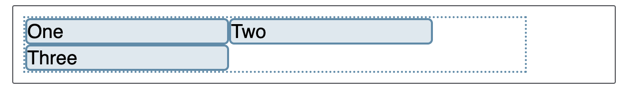
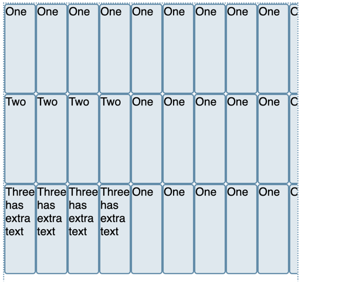

# 학습정리

## HTML5 Layout Tag
Html5 레이아웃 태그에는 6가지 정도가 있다.  

`header` : 페이지 상단의 머릿말을 정의  
`nav` : 네비게이션(메뉴), 사이트 내의 다른 페이지로 이동  
`aside` : 카테고리, 현재 페이지 외의 컨텐츠  
`main` : 가장 중요한 핵심 컨텐츠를 감싸는 태그, 한 페이지에 하나 사용, 강조의 느낌  
`section` : main 내 컨텐츠를 구분   
`article` : 독립적인 하나의 컨텐츠, 예시) 이름처럼 블로그 글이나 뉴스 기사  
`footer` : 페이지 최하단의 부가 정보, 예시) 저작권, 연락처, 사이트맵 등등  

## DOM(Document Object Model)  

### DOM 의 개념
[DOM MDN](https://developer.mozilla.org/ko/docs/Web/API/Document_Object_Model/Introduction)  
DOM 은 HTML, XML 문서의 프로그래밍 `interface` 이다. 각 브라우저마다 이 인터페이스를 구현해서 저마다의 DOM 을 가지고 있다.  

웹 페이지는 일종의 `문서(document)` 이다. DOM 은 이 문서를 트리 구조로 만들어서(구조화) 제공하며 이렇게 구조화된 정보를 바탕으로
프로그래밍 언어가 동적으로 문서의 구조, 스타일, 내용 등을 변경할 수 있게 돕는다.  

> DOM 은 `nodes` 와 `objects` 로 문서를 표현한다.  
> 
> DOM tree 에서 모든 요소는 전부 `node` 로 표현된다. HTML 태그, 텍스트, 속성(attribute) 등은 전부 하나의 노드이다.  
> => `node` 는 문서를 구조적으로 표현하는 단위이다.  
> 
> `object` 는 노드에 대한 실제 프로그래밍 인터페이스이다. 
> 객체는 노드를 조작할 수 있는 인터페이스를 제공함으로써 프로그래밍 언어가 문서와 문서의 요소에 접근할 수 있도록 한다.  
> => `object` 는 노드에 대한 접근을 제공한다.


만약 DOM 이 없다면 프로그래밍 언어(js 등)은 문서(웹 페이지 or XML 페이지) 
및 페이지의 요소들과 관련된 모델이나 개념들에 대한 정보를 얻을 수 없다. (문서에 접근할 수 없다)  

초기에는 자바스크립트와 DOM 이 밀접하게 연결되어 있었으나 이제는 프로그래밍 언어와 독립적으로 디자인되었다. 
따라서 어떠한 언어에서도 DOM 을 구현할 수 있다.  

### DOM 의 핵심 인터페이스
- document.getElementById(id)
- document.getElementsByTagName(name)
- document.createElement(name)
- parentNode.appendChild(node)
- element.innerHTML
- element.style.left
- element.setAttribute
- element.getAttribute
- element.addEventListener
- window.content
- window.onload
- window.dump
- window.scrollTo

## Flexbox
[Flexbox 의 기본 개념](https://developer.mozilla.org/ko/docs/Web/CSS/CSS_flexible_box_layout/Basic_concepts_of_flexbox)
### Flexbox 의 개념
> flexbox 는 아이템간 공간 배분과 강력한 정렬 기능을 제공하기 위한 `1차원` 레이아웃 모델  

`1차원`이라 칭하는 이유는, 레이아웃을 다룰 때 한 번에 하나의 차원만 다룬다는 뜻이다.  
이는 행만 다루거나, 열만 다룬다는 의미다.  

이후에 공부해야 할 Grid 레이아웃은 2차원 모델이다.  

### 주축과 교차축
flexbox 에는 `flex-direction` 속성을 사용하여 `주축` 을 설정하고, 주축에 수직인 축이 `교차축` 으로 설정된다.  
flex 되는 아이템들은 `주축을 기준으로 배치` 되고, `교차축을 기준으로 정렬` 된다.

#### 주축
- row (`가로`, 아이템이 왼쪽에서 오른쪽으로 배치)
- row-reverse (`가로`, 아이템이 오른쪽에서 왼쪽으로 배치)
- column (`세로`, 아이템이 위에서 아래로 배치)
- column-reverse (`세로`, 아이템이 아래에서 위로 배치)

#### 교차축
교차축은 주축에 수직이다.  

따라서 주축이 가로(row | row-reverse) 라면 교차축은 세로이고, 
주축이 세로(column | column-reverse) 라면 교차축은 가로이다.

### Flex 컨테이너
> 문서의 영역 중에서 `flexbox`가 놓여있는 영역을 `flex 컨테이너`라고 부릅니다. 
> flex 컨테이너를 생성하려면 영역 내의 컨테이너 요소의 `display` 값을 `flex` 혹은 `inline-flex`로 지정합니다. 
> 이 값이 지정된 컨테이너의 일차 자식(direct children) 요소가 flex 항목이 됩니다

여기서 일차 자식이란 부모의 바로 밑 자식을 의미한다. 할머니에게 있어서 손자는 일차 자식이 아닌 이차 자식이다.

#### flex-wrap
> flex-box 는 1차원 모델이지만 flex 항목이 여러 행/열에 나열되도록 할 수 있습니다

flex-box 에 있는 flex 항목은 가로 혹은 세로로만 배치되는 1차원 모델이다. 다만 다음 가로줄 혹은 다음 세로줄에 배치되도록 해주는 속성이
`flex-wrap` 이다.  

```css
.box {
    display: flex;
    flex-direction: row;
    flex-wrap: wrap;
}
```
  

아이템이 하나의 행에 들어가지 않을 정도로 크다면, 다음 행에 배치되는 모습을 볼 수 있다.

```css
.box {
  width: 500px;
  height: 550px;
  display: flex;
  overflow: scroll;
  flex-direction: column;
  flex-wrap: wrap;
}

div {
    width: 50px;
    height: 150px;
}
```

  
아이템이 하나의 열에 들어가지 않을 정도로 크다면, 다음 열에 배치되는 모습을 볼 수 있다.